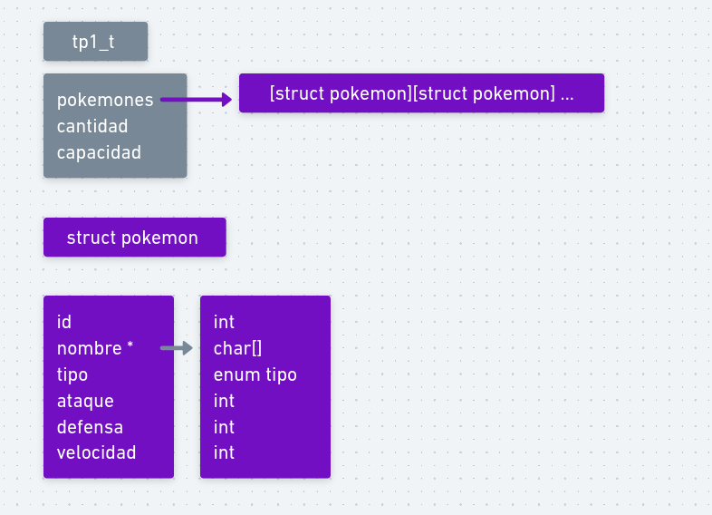
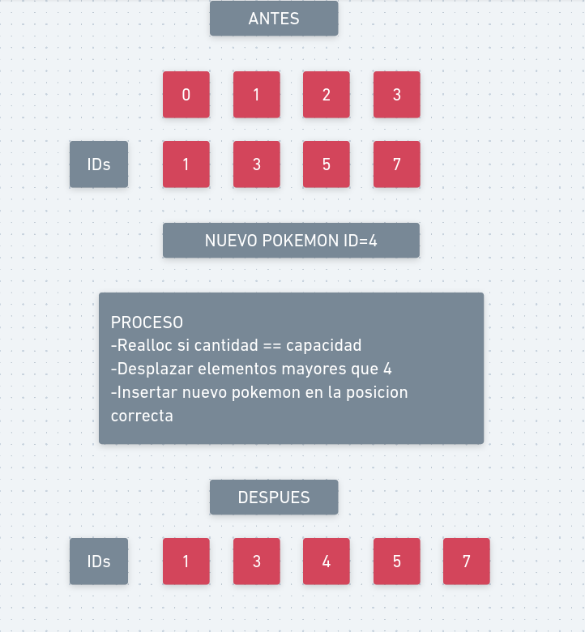
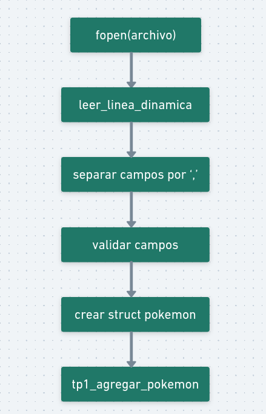
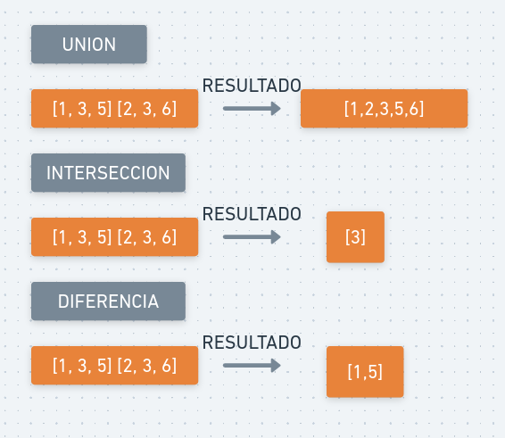

<div align="right">

</div>

# TDA Lista de Pokemones (TP1)

## Alumno: Valeria Pombo Muzzolón - 112754 - vpombo@fi.uba.ar

### Compilación y Ejecución

-   **Para compilar:**

    ```bash
    gcc -Wall -Wextra -std=c99 -g tp1.c main.c -o tp1
    ```

-   **Para ejecutar:**

    ```bash
    ./tp1 pokedex.csv buscar nombre pikachu
    ```

-   **Para ejecutar con Valgrind (verificación de memoria):**

    ```bash
    valgrind --leak-check=full ./tp1 pokedex.csv buscar nombre pikachu
    ```

---

### Funcionamiento General

El TDA `tp1_t` implementa una **Lista Ordenada** mediante un **arreglo dinámico de `struct pokemon`** que crece a demanda. La estructura se mantiene siempre ordenada por el campo `id` del Pokémon, lo que es clave para las búsquedas rápidas y las operaciones de conjunto eficientes.

Cada `struct pokemon` almacena: `id`, `nombre` (en memoria dinámica para flexibilidad), `tipo` (como un `enum`), y los *stats* (`ataque`, `defensa`, `velocidad`).

El flujo del programa es el siguiente:
1.  **Lectura:** Abre un archivo CSV, lee línea por línea con `leer_linea_dinamica`, valida los datos y si la línea es válida, crea el Pokémon.
2.  **Inserción:** El nuevo Pokémon se agrega al arreglo mediante `tp1_agregar_pokemon`, que se encarga de desplazar los elementos para mantener el orden por `id`. Los Pokemones con ID duplicado son descartados.

**Funcionalidades Principales:**

-   **Búsqueda:** `tp1_buscar_id` utiliza **búsqueda binaria ($O(\log n)$)**. `tp1_buscar_nombre` usa **búsqueda lineal ($O(n)$)**.
-   **Operaciones de Conjunto:** `union`, `interseccion` y `diferencia` explotan el orden del arreglo para realizar comparaciones eficientes en tiempo **$O(n+m)$**.

---

### Diagramas de Memoria

#### 1. Estructura Interna del TP1

<div align="center">  </div>

**Composición:**
-   `tp1_t` (la lista) contiene un **puntero** al bloque de memoria principal (`pokemones`).
-   Guarda la `cantidad` actual de Pokemones y la `capacidad` total del arreglo.
-   Cada `struct pokemon` tiene su `nombre` apuntando a una cadena de caracteres separada en el *heap*, permitiendo nombres de longitud variable.

#### 2. Agregado de Pokémon

<div align="center">  </div>

**Proceso de `tp1_agregar_pokemon`:**
1.  **Capacidad:** Si la lista está llena, se realiza un `realloc` para aumentar la capacidad del arreglo (aunque la implementación actual lo hace de a uno, lo óptimo sería duplicar el espacio).
2.  **Búsqueda y Desplazamiento:** Se localiza la posición correcta según el `id`. Los elementos con IDs mayores se desplazan a la derecha.
3.  **Inserción:** El nuevo Pokémon se coloca en el hueco creado, manteniendo el arreglo ordenado.

#### 3. Lectura y Validación

<div align="center">  </div>

**Proceso de `tp1_leer_archivo`:**
1.  Se lee una línea completa del CSV (ej. "1,Bulbasaur,PLAN,45,49,49") usando `leer_linea_dinamica`.
2.  Se **parsea y valida** cada campo (ID, nombre no vacío, tipo válido con `tipo_from_string`, etc.).
3.  Si la línea es **inválida** (ej. campo faltante, tipo erróneo), se ignora y se libera la línea. Si es **válida**, se crea el `struct pokemon` y se llama a `tp1_agregar_pokemon`.

#### 4. Operaciones de Conjunto

<div align="center">  </div>

Las operaciones (Unión, Intersección, Diferencia) se basan en el principio de *Merge* (mezcla) de arreglos ordenados:
-   Se usan dos índices (`i` y `j`) para recorrer ambos TDA simultáneamente.
-   Se comparan los IDs en O(1).
-   **Unión:** Agrega el Pokémon con el ID menor (o el del segundo TDA si los IDs son iguales) y avanza ambos índices si son iguales para evitar duplicados.
-   **Intersección:** Solo agrega el Pokémon si los IDs son **iguales** (avanzando ambos índices).
-   **Diferencia (TP1 - TP2):** Agrega el Pokémon solo si su ID es **menor** que el Pokémon actual del segundo TDA.

---

### Complejidades Computacionales

| Función | Complejidad Temporal | Justificación |
| :--- | :--- | :--- |
| `tp1_crear` | $O(1)$ | Inicialización de campos y asignación inicial de memoria. |
| `tp1_agregar_pokemon` | $O(n)$ | En el peor caso, se debe desplazar $O(n)$ elementos para mantener el orden. |
| `tp1_buscar_nombre` | $O(n)$ | Se requiere una búsqueda lineal ya que no está ordenado por nombre. |
| `tp1_buscar_id` | $O(\log n)$ | Búsqueda binaria, aprovechando el arreglo ordenado. |
| `tp1_con_cada_pokemon` | $O(n)$ | Recorrido lineal de todos los elementos. |
| `tp1_guardar_archivo` | $O(n)$ | Recorrido lineal y escritura de $n$ elementos. |
| `tp1_union` | $O(n + m)$ | Se recorren ambos arreglos ordenados una sola vez (algoritmo de *merge*). |
| `tp1_interseccion` | $O(n + m)$ | Ídem. |
| `tp1_diferencia` | $O(n + m)$ | Ídem. |
| `tp1_destruir` | $O(n)$ | Liberación de $n$ nombres individuales y luego el arreglo principal. |

---

### Respuestas a Preguntas Teóricas

#### Elección de la Estructura (Arreglo Dinámico)

Se eligió un arreglo dinámico para almacenar los Pokemones porque es la estructura óptima para el requerimiento principal: **búsqueda por ID rápida ($O(\log n)$)** y **operaciones de conjunto eficientes ($O(n+m)$)**.

* **Ventajas:** El acceso por índice ($O(1)$) facilita la búsqueda binaria y el recorrido secuencial. El ordenamiento por ID permite fusionar, interceptar o diferenciar dos listas ordenadas sin tener que comparar cada elemento con cada elemento (evitando $O(n \cdot m)$).
* **Desventajas:** La inserción (`tp1_agregar_pokemon`) es costosa ($O(n)$) debido a la necesidad de desplazar elementos para mantener el orden, y el crecimiento de la capacidad puede implicar reasignaciones de memoria.

#### Disposición en Memoria

La lista (`tp1_t`) reside típicamente en el *stack* o el *heap*, apuntando al arreglo de `struct pokemon` en el *heap*. Para manejar nombres de longitud variable de manera flexible, cada `struct pokemon` almacena su `nombre` como una **cadena separada en el *heap***. Esta técnica, aunque requiere más llamadas a `malloc`/`free` ($O(n)$), asegura que no haya desperdicio de espacio por *padding* para nombres largos ni truncamiento de nombres largos, además de permitir una correcta liberación de recursos en `tp1_destruir`.

#### Dificultades en la Implementación

Las principales dificultades encontradas y gestionadas fueron:

1.  **Manejo de Memoria:** Gestionar correctamente la memoria dinámica tanto para el arreglo (`pokemones`) como para las cadenas de `nombre` dentro de cada estructura. Un fallo aquí podría causar fugas (`leaks`) o accesos inválidos.
2.  **Lectura Robusta:** Implementar una lectura del archivo CSV que pueda manejar **líneas con formato incorrecto**, **valores inválidos** (ej. un tipo desconocido), o **IDs duplicados**, sin caer en errores ni corromper la lista.
3.  **Mantenimiento del Orden:** Implementar eficientemente la inserción (`tp1_agregar_pokemon`) garantizando que el arreglo permanezca ordenado por `id` en todo momento, a pesar de su costo $O(n)$.

---

## 2. Diagramas Simplificados

Aquí están los diagramas enfocados en la lógica central de cada operación.

### 1. Estructura Interna del TP1 (Simplificado)

Este diagrama muestra solo los componentes esenciales: la estructura principal, el arreglo y los nombres separados.


### 2. Agregado de Pokémon con Desplazamiento

Este diagrama ilustra el costo $O(N)$ de la inserción: primero se hace espacio (desplazamiento) y luego se inserta el nuevo elemento en la posición correcta.


### 3. Lectura de Archivo y Validación (Flujo de Control)

Este diagrama simplifica el flujo de lectura y validación de una línea de datos.


### 4. Operación de Unión (Algoritmo de Merge)

Este diagrama muestra cómo se combinan dos listas ordenadas (O(n+m)) usando dos punteros sin tener que anidar bucles.
